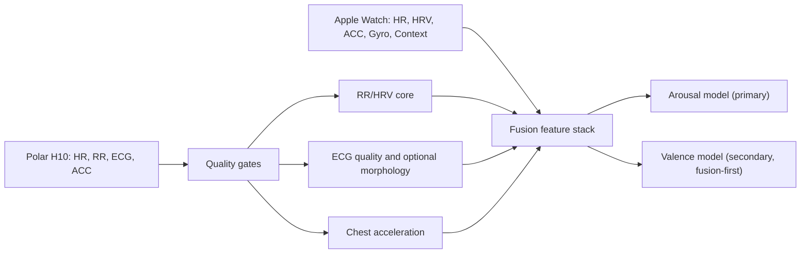

# E2.1: Polar H10 feature stack для arousal/valence fusion

## Статус

- Step ID: `E2.1`
- Status: `completed`
- Date: `2026-03-27`

## Запрос

Проверить, что именно можно получить из `Polar H10`, сопоставить это с текущей реализацией в `on-go/on-go-ios` и зафиксировать, какие признаки и quality-gates нужны для моделей `arousal + valence` с основным ориентиром на связку `Apple Watch + Polar H10`.

## Что подтверждено по Polar H10

По официальным материалам Polar:

1. `Polar H10` через SDK отдает:
   - `heart rate` и `RR interval` c частотой `1 Hz`;
   - `ECG` в `uV` c частотой `130 Hz`;
   - `accelerometer` c частотами `25/50/100/200 Hz` и диапазонами `2G/4G/8G`;
   - управление внутренней записью, но внутренняя запись у `H10` поддерживает только `HR` c шагом `1 s`.
2. В user manual отдельно указано, что у `Polar H10` есть встроенный `accelerometer`, а `accelerometer data` доступны только через `SDK`.
3. Устройство имеет internal memory, но для нашего сценария это не заменяет live `ECG/RR/ACC` поток: как fallback это годится в первую очередь для `HR`-трека, а не для полного research-grade fusion.

Официальные источники:

1. [Polar H10 user manual](https://support.polar.com/e_manuals/h10-heart-rate-sensor/polar-h10-user-manual-english/manual.pdf)
2. [Polar BLE SDK repository](https://github.com/polarofficial/polar-ble-sdk)
3. [Polar H10 SDK feature page](https://github.com/polarofficial/polar-ble-sdk/blob/master/documentation/products/PolarH10.md)
4. [Polar research tools page](https://www.polar.com/en/science/research-tools)

## Что уже есть у нас в коде

### Capture / raw schema

1. В raw schema предусмотрены потоки:
   - `polar_ecg`
   - `polar_rr`
   - `polar_hr`
   - `polar_acc`
2. В `on-go-ios` live adapter сейчас реально стримит только:
   - `polar_ecg`
   - `polar_rr`
   - `polar_hr`
3. `Polar` callback также приносит `contact` и `contactSupported`, но эти поля сейчас не сохраняются в raw package.

### Processing / features

1. `signal-processing-worker` уже умеет принимать `polar_acc`, но live capture его пока не поставляет.
2. Текущий feature-layer по сути baseline-only:
   - `mean/std/min/max/last` по numeric key;
   - magnitude для acceleration/gyro;
   - только один RR-derived признак: `rr_like__rmssd`.
3. Полноценного `RR/HRV` стека, frequency-domain признаков и ECG quality features пока нет.

## Ключевой вывод

`Polar H10` уже дает нам достаточно данных, чтобы построить сильную cardio-ветку для `arousal` и полезную вспомогательную ветку для `valence`.

Проблема сейчас не в отсутствии данных как таковых, а в том, что наш pipeline использует только малую часть доступного сигнала:

1. не пишет `polar_acc` в live capture;
2. не сохраняет `contact/contactSupported` как quality-сигнал;
3. почти не извлекает `HRV` из `RR`;
4. вообще не использует `ECG` как quality/backstop источник;
5. не делает baseline-normalized признаки для персонализированной affect-модели.

## Рекомендуемый feature stack

### 1. RR/HR time-domain core

Это должен быть первый обязательный блок для `arousal` и базовый блок для `valence`.

Рекомендуемый набор:

1. `mean_rr`
2. `median_rr`
3. `mean_hr`
4. `hr_min`
5. `hr_max`
6. `hr_range`
7. `sdnn`
8. `rmssd`
9. `sdsd`
10. `nn20`
11. `pnn20`
12. `nn50`
13. `pnn50`
14. `cvnn`
15. `cvsd`
16. `rr_range`
17. `rr_iqr`
18. `mad_rr`
19. `rr_skew`
20. `rr_kurt`

Назначение:

1. `arousal`: основной физиологический сигнал активации и восстановления.
2. `valence`: слабее как прямой маркер, но полезен как компонент персонализированного состояния в паре с watch-context.

### 2. RR non-linear features

Нужны для более устойчивого описания структуры вариабельности на коротких окнах.

Рекомендуемый минимум:

1. `sd1`
2. `sd2`
3. `sd1_sd2_ratio`

Опционально вторым этапом:

1. `csi`
2. `cvi`
3. `sample_entropy`
4. `approx_entropy`

Правило:

1. в `E2.2` брать только те non-linear признаки, которые устойчивы на наших коротких окнах;
2. `entropy/DFA` не тащить в первый инкремент без отдельной валидации длины окна и чувствительности к артефактам.

### 3. RR frequency-domain features

Нужны, но только при честных окнах и quality-gates.

Рекомендуемый набор:

1. `vlf_power`
2. `lf_power`
3. `hf_power`
4. `total_power`
5. `lf_hf_ratio`
6. `lf_norm`
7. `hf_norm`

Ограничение:

1. эти признаки не должны считаться на слишком коротких окнах как headline-source;
2. для них нужен отдельный longer-window path, иначе они будут шумнее, чем полезнее.

Рекомендуемый режим:

1. `arousal`: использовать как secondary/diagnostic на окнах `>=120 s`;
2. `valence`: использовать только как fusion-level дополнительный блок, а не как основной драйвер.

### 4. ECG-derived features

`ECG` от `H10` нужен не только как сырой канал, но и как quality/backstop источник.

Первый безопасный набор:

1. `ecg_sample_count`
2. `ecg_coverage_ratio`
3. `ecg_voltage_mean`
4. `ecg_voltage_std`
5. `ecg_peak_count`
6. `ecg_peak_success_ratio`
7. `ecg_noise_ratio`
8. `ecg_baseline_wander_score`

Назначение:

1. проверить, насколько надежен `RR` поток в окне;
2. при необходимости восстанавливать или верифицировать beat quality;
3. отделять физиологический сигнал от плохого контакта/шума.

Правило:

1. в первом практическом инкременте использовать `ECG` прежде всего для quality-gates;
2. полноценную morphology-ветку (`QRS amplitude`, beat-template variance и т.д.) оставить на следующий шаг после стабилизации RR pipeline.

### 5. Polar ACC features

Chest-acceleration нужна не как замена watch motion, а как дополнительный sensor-level disambiguation источник.

Рекомендуемый набор:

1. `polar_acc_x/y/z mean/std/min/max`
2. `polar_acc_mag_mean`
3. `polar_acc_mag_std`
4. `polar_acc_mag_max`
5. `polar_acc_energy`
6. `polar_acc_jerk_mean`
7. `polar_acc_jerk_std`
8. `polar_acc_stationary_ratio`
9. `polar_acc_motion_burst_count`

Назначение:

1. отделять физически обусловленный рост ЧСС от affective arousal;
2. лучше чистить RR/ECG окна от motion contamination;
3. усиливать fusion для `valence`, где контекст и тип движения критичны.

### 6. Quality and gating metrics

Этот блок обязателен. Без него HRV-признаки будут давать нестабильный шум.

Рекомендуемый набор:

1. `rr_valid_count`
2. `rr_valid_ratio`
3. `rr_outlier_ratio`
4. `rr_gap_count`
5. `rr_gap_duration_ms`
6. `rr_window_duration_ms`
7. `contact_supported`
8. `contact_true_ratio`
9. `ecg_coverage_ratio`
10. `ecg_peak_success_ratio`
11. `polar_motion_artifact_ratio`
12. `paired_overlap_ratio`

Правило допуска окна в modeling:

1. `RR` окно не используется, если valid coverage слишком низкое;
2. frequency-domain блок не используется без достаточной длины и стабильности окна;
3. fusion-окно не используется как headline, если cross-device overlap ниже порога.

## Какие признаки нужны именно для arousal и valence

### Arousal

Для `arousal` `Polar H10` должен быть основной кардиосенсор.

Приоритет feature families:

1. `RR/HR time-domain`
2. `RR non-linear`
3. `ECG quality`
4. `Polar ACC` как motion disambiguation
5. `Watch motion/context` как fusion-усиление

Практический вывод:

1. `arousal` можно и нужно делать `fusion-first`, но даже `polar_rr_only` должен стать сильным baseline.
2. Именно RR/HRV stack сейчас вероятнее всего даст самый большой прирост относительно нашего текущего baseline.

### Valence

Для `valence` одного `Polar H10` недостаточно как сильного standalone источника.

Практический вывод:

1. `valence` нужно строить как `fusion-first` track;
2. вклад `Polar H10` здесь полезен, но скорее как:
   - baseline physiology;
   - regulation/recovery signal;
   - personalized delta-from-baseline источник;
3. `watch context/motion + temporal context + personalized baseline shifts` для `valence` не менее важны, чем сами HRV признаки.

Поэтому для `valence` рекомендуются два представления признаков:

1. `absolute features`
2. `delta_to_personal_baseline` и `zscore_to_personal_baseline`

Именно baseline-normalized признаки особенно важны для `valence`, потому что межсубъектная вариативность здесь выше, чем прямой физиологический эффект.

## Рекомендуемые окна

Не все признаки нужно считать на одном и том же окне.

Рекомендуемый первый рабочий режим:

1. `RR/HR core`: `60 s` окно, `15 s` шаг
2. `ECG quality`: `10-30 s` окно, `5-10 s` шаг
3. `Polar ACC`: `10 s` окно, `5 s` шаг
4. `RR spectral`: `120 s` окно, `30 s` шаг
5. headline-evaluation: после агрегации `window -> segment`

## Что нужно изменить в коде следующим шагом

### Capture

1. Добавить live `polar_acc` streaming в `LivePolarH10SDKAdapter`.
2. Сохранять `contact` и `contactSupported` в raw samples / metadata.
3. Явно логировать фактическую готовность `HR`, `ECG`, `ACC` по устройству.

### Processing

1. Расширить `signal-processing-worker` полноценным `RR/HRV` feature extractor.
2. Добавить RR artifact detection и quality metrics.
3. Добавить `ECG quality` extractor.
4. Добавить `Polar ACC` motion/statistical features.
5. Ввести baseline-normalized feature branch для personalization/fusion.

### Modeling

Добавить минимум три постановки:

1. `polar_rr_only`
2. `polar_rr_acc`
3. `watch_plus_polar_fusion`

и прогонять их отдельно по:

1. `arousal_coarse`
2. `arousal ordinal`
3. `valence coarse`
4. `valence ordinal` (exploratory)

## Evaluation implications

Для этой линии надо заранее фиксировать не только признаки, но и headline-метрики.

### Arousal

1. `macro_f1`
2. `balanced_accuracy`
3. `quadratic_weighted_kappa`
4. `mae` для ordinal версии
5. `spearman_rho`
6. `ece` / calibration error

### Valence

1. `macro_f1`
2. `balanced_accuracy`
3. `quadratic_weighted_kappa`
4. `spearman_rho`
5. `ece`

Ограничение:

1. `valence` остается более рискованным track и не должен промоутиться по proxy labels или слабым transfer-результатам.

## Следующий рекомендуемый шаг

`E2.2` — реализовать расширенный `Polar H10` feature stack:

1. live `polar_acc` capture;
2. сохранение `contact/contactSupported`;
3. полноценные `RR/HRV` и `ECG quality` признаки в `signal-processing-worker`;
4. fusion-ready benchmarking для `arousal + valence`.
