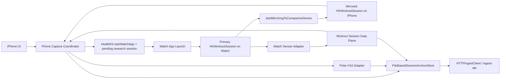

# HKWorkoutSession Migration Design Note

## Статус документа

- Дата: `2026-03-22`
- Фаза: `B - Capture Prototype`
- Назначение: подробно зафиксировать, почему текущий `WatchConnectivity`-подход недостаточен для надежного watch capture, и каким должен быть переход на `HKWorkoutSession`/mirrored session flow перед реализацией.

## Зачем нужен этот документ

В текущем capture-прототипе:

1. `iPhone` создает `session_id` и запускает `Polar`.
2. `Apple Watch` начинает участие в записи только если watch runtime уже запущен и успел начать ждать handoff.
3. Для запуска и data plane используется в основном `WatchConnectivity`.

После шага `B10` у нас больше нет нулевых placeholder-значений в raw package, и watch app автоматически входит в режим ожидания handoff при открытии экрана. Но это исправляет только локальный UX-изъян. Архитектурная проблема остается:

1. watch app по-прежнему зависит от того, что она уже открыта или быстро станет активной;
2. runtime часов не привязан к платформенно рекомендованному workout lifecycle;
3. нет гарантированного supported-механизма для длительного live-capture на часах во время активной исследовательской сессии;
4. lifecycle записи и lifecycle watch execution сейчас живут в разных координатах.

Цель этого документа: зафиксировать целевую архитектуру, при которой `Apple Watch` становится платформенно корректным primary runtime для своей части capture, а `iPhone` получает mirrored session и остается координатором backend package/export/upload.

## Краткий вывод

Рекомендуемое направление:

1. перевести watch-side lifecycle с `WatchConnectivity start/stop envelopes` на `HKWorkoutSession`;
2. сделать `Apple Watch` владельцем `primary workout session`;
3. сделать `iPhone` владельцем `mirrored workout session`;
4. использовать mirrored workout session как основной transport для session control и sample-batch payloads между часами и телефоном;
5. сохранить `iPhone` владельцем research `session_id`, raw package assembly, upload и backend handoff.

Иначе говоря:

1. `watchOS` должен владеть platform session;
2. `iPhone` должен владеть research/export session;
3. между ними нужен четкий bridge, а не размытая смесь UI-событий и `WCSession`.

## Проблема в текущем дизайне

### Текущий runtime

Сейчас runtime описан в [capture-runtime.md](/Users/kgz/Desktop/p/on-go-ios/docs/architecture/capture-runtime.md):

1. `PhoneCaptureCoordinator` создает `session_id`;
2. `PolarH10Adapter` стартует на iPhone;
3. `WatchCaptureController` получает handoff и начинает watch-side capture;
4. stream batches с часов пересылаются на iPhone;
5. iPhone собирает финальный raw package и отправляет его в ingest.

### Что в этом ломается

Практические failure modes:

1. `WatchConnectivity`-handoff не равен гарантированному старту watch runtime.
2. watch app может быть не открыта, не успеть перейти в активное состояние или потерять runtime в неподходящий момент.
3. `heart_rate/hrv` и `motion` на часах живут внутри платформенных ограничений `HealthKit/CoreMotion`, а наш lifecycle сейчас описан поверх них отдельно.
4. логика "нажать Start на часах" была побочным симптомом: системе нужен живой watch runtime, а текущая архитектура не давала надежный платформенный способ этот runtime удерживать.

### Что уже исправлено, но чего этого недостаточно

Шаг `B10` исправил:

1. serialization реальных sample payloads вместо `sampleCount-only`;
2. авто-вход watch app в режим ожидания handoff при открытии экрана.

Но он не исправил главного:

1. если watch app не открыта, мы все еще зависим от косвенного запуска и reachability;
2. data/control plane часов все еще не привязан к `WorkoutSession`;
3. архитектура все еще не соответствует рекомендованному multi-device workout flow Apple.

## Основание в официальных материалах Apple

Ниже зафиксированы не общие впечатления, а конкретные platform hints, на которые опирается дизайн.

### 1. Если у приложения есть watch app, workout лучше стартовать на часах

В WWDC25 Apple прямо рекомендует: если у приложения есть watch app и нужен полный набор workout metrics, workout следует запускать на watch и затем mirror на `iPhone/iPad`.

Источник:

1. [Track workouts with HealthKit on iOS and iPadOS, WWDC25](https://developer.apple.com/kr/videos/play/wwdc2025/322/?time=574)

Практический вывод для нас:

1. `Apple Watch` должен быть primary runtime для watch-originated live capture.
2. `iPhone` не должен притворяться владельцем workout lifecycle часов.

### 2. Mirrored workout session умеет поднимать iPhone и передавать ему активную session

В WWDC23 Apple показывает, что при начале mirroring на watch `iPhone` может быть поднят в фоне, получить mirrored workout session и продолжить flow через заранее зарегистрированный handler.

Источник:

1. [Building a multidevice workout app, WWDC23](https://developer.apple.com/videos/play/wwdc2023/10023/)

Практический вывод для нас:

1. нам не нужно зависеть от того, что `iPhone` уже заранее открыл какой-то `WCSession receive()` цикл;
2. правильной точкой входа на `iPhone` становится `mirroring start handler`, а не произвольный handoff envelope.

### 3. iPhone может инициировать запуск watch app с workout configuration

В том же WWDC23 Apple показывает phone-initiated flow: `iPhone` создает workout configuration, вызывает `startWatchApp`, а watch app строит primary session уже у себя.

Источник:

1. [Building a multidevice workout app, WWDC23](https://developer.apple.com/videos/play/wwdc2023/10023/)

Практический вывод для нас:

1. пользователь все еще может нажимать `Start` на `iPhone`;
2. но технически это должно стартовать watch-side workout flow, а не просто посылать `WatchConnectivity`-команду "начни mirroring".

### 4. Primary и mirrored session синхронизируют lifecycle и умеют обмениваться custom data

WWDC23 также показывает:

1. синхронизацию состояния между primary и mirrored sessions;
2. custom payload exchange через workout-session remote data APIs;
3. контроль `pause/resume/stop` между устройствами.

Источник:

1. [Building a multidevice workout app, WWDC23](https://developer.apple.com/videos/play/wwdc2023/10023/)

Практический вывод для нас:

1. mirrored workout session может заменить `WatchConnectivity` как основной control plane;
2. mirrored workout session может также стать основным data plane для watch sample batches.

## Границы решения

### Что этот документ рекомендует

1. использовать `HKWorkoutSession` как platform lifecycle для live watch capture;
2. использовать mirrored workout session как transport для состояния и data batches;
3. сохранить существующие research/raw package сущности (`session_id`, manifest, streams, artifacts);
4. минимизировать изменения в backend-контрактах.

### Что этот документ не утверждает

1. что `WatchConnectivity` надо удалить полностью в том же самом шаге;
2. что нужно немедленно переписывать все collectors на `HKLiveWorkoutBuilder` statistics;
3. что research session должна стать workout artifact в backend-модели;
4. что migration снимает все продуктовые/App Review риски автоматически.

## Важная продуктовая оговорка

`HKWorkoutSession` является технически корректным направлением для устойчивого watch-originated live flow. Но у него есть semantic cost:

1. мы будем моделировать исследовательскую paired-сессию как workout-like session;
2. это хорошо ложится на сценарии `movement block`, `recovery`, `controlled block`, live heart/motion capture;
3. это хуже выглядит, если продуктово сессия не похожа на workout вообще.

Поэтому решение корректно технически, но должно быть осознанным продуктово:

1. мы используем workout APIs не ради фитнес-метрик как таковых;
2. мы используем их как поддерживаемый platform lifecycle для длительной watch-side сессии;
3. это нужно держать в уме при дальнейшем product packaging и App Review positioning.

## Целевая архитектура

### Ownership model

После миграции ownership должен быть разделен так:

1. `Apple Watch` владеет `primary HKWorkoutSession`.
2. `iPhone` владеет `mirrored HKWorkoutSession`.
3. `iPhone` владеет research `session_id`.
4. `iPhone` владеет `FileBasedSessionArchiveStore`, raw package assembly и upload.
5. `Polar H10` остается phone-side устройством и продолжает жить на `iPhone`.

Это ключевой момент:

1. `WorkoutSession` ownership не равен ownership исследовательской сессии.
2. Мы не переносим backend/export ownership на часы.

### Runtime topology

### Session lifecycle at high level

1. Пользователь нажимает `Prepare` на `iPhone`.
2. `iPhone` создает research `session_id` и локально подготавливает pending session context.
3. Пользователь нажимает `Start` на `iPhone`.
4. `iPhone` инициирует запуск watch app через HealthKit workout-start flow.
5. watch app создает primary `HKWorkoutSession`.
6. watch app вызывает start mirroring к companion device.
7. `iPhone` получает mirrored session через HealthKit handler.
8. `iPhone` связывает mirrored workout session с уже подготовленным research `session_id`.
9. `iPhone` стартует `Polar H10`.
10. watch app начинает sensor capture и передает sample batches через workout-session data plane.
11. `iPhone` объединяет `Polar + Watch` потоки в raw package.
12. stop/pause/resume координируются через workout-session lifecycle, а package/export/upload остаются phone-side.

## Детальный целевой flow

### A. Prepare на iPhone

На этапе `Prepare`:

1. `PhoneCaptureCoordinator` создает research `session_id`.
2. Формируется `PendingWorkoutCaptureContext`:
   - `session_id`
   - `subject_id`
   - `protocol_version`
   - `timezone`
   - ожидаемая конфигурация потока
   - локальный `prepared_at`
3. `archiveStore.prepare(session:)` может быть вызван уже здесь, как и сейчас.
4. workout session еще не стартует.

Это важно, потому что:

1. backend/export identity должна существовать до platform start;
2. mirrored workout session должна присоединиться к уже подготовленному research context, а не наоборот.

### B. Start на iPhone

На `Start`:

1. `iPhone` создает `HKWorkoutConfiguration`.
2. `iPhone` вызывает HealthKit `startWatchApp` flow.
3. `PhoneCaptureCoordinator` переводит local state не сразу в `.recording`, а в промежуточное состояние наподобие `starting_watch_workout`.
4. Если mirrored session не приходит за timeout, старт считается неуспешным.

Рекомендуемый смысл `HKWorkoutConfiguration`:

1. activity type должен быть один стабильный исследовательский тип, а не динамически меняться по сегментам;
2. детали research protocol не должны кодироваться только в workout type;
3. сегменты `baseline_rest`, `movement_block`, `recovery` остаются частью research-level labels/events.

### C. Launch и primary session на watch

На watch:

1. app запускается платформенно корректным способом;
2. watch создает primary `HKWorkoutSession`;
3. watch поднимает все необходимые делегаты и builder/runtime bindings;
4. watch начинает mirrored session к companion;
5. watch переходит в стабильный active capture state.

Это заменяет текущую логику:

1. "watch app открыта";
2. "экран уже на месте";
3. "кнопка Start на watch вручную перевела runtime в ожидание".

### D. Mirroring handler на iPhone

На `iPhone` должен появиться отдельный runtime boundary, условно:

1. `WorkoutSessionBridge` или `MirroredWorkoutCoordinator`;
2. он регистрирует `mirroring start handler` в HealthKit как можно раньше в app lifecycle;
3. при получении mirrored session:
   - сохраняет strong reference на session;
   - назначает delegate;
   - связывает platform session с pending research session;
   - уведомляет `PhoneCaptureCoordinator`, что watch side действительно активирован.

Без этого migration будет неполным. Просто создать `HKWorkoutSession` на watch недостаточно. Нужна явная phone-side binding layer.

### E. Передача research metadata на watch

`HKWorkoutConfiguration` не должна рассматриваться как полноценный носитель всей research metadata.

Рекомендуемый подход:

1. `iPhone` создает research `session_id` заранее;
2. после attach mirrored session `iPhone` отправляет watch-side control payload через workout-session data channel;
3. payload должен включать:
   - `session_id`
   - `protocol_version`
   - `timezone`
   - возможно `segment_plan`
   - flags для включенных collectors

Это дает более чистую модель, чем пытаться сделать watch владельцем backend session identity.

### F. Start Polar только после watch attach

Рекомендуется не начинать окончательную запись `Polar` до тех пор, пока:

1. mirrored session не пришла на `iPhone`;
2. phone-side coordinator не подтвердил, что watch runtime готов принимать session data/control;
3. research `session_id` не передан на watch.

Иначе снова возникнет перекос:

1. `Polar` уже пишет;
2. watch еще не находится в стабильной session;
3. paired subset будет с пропусками в самом начале.

Правильный target:

1. `Start` на iPhone означает "поднять stable paired runtime";
2. только после этого стартует полная paired capture.

### G. Watch data plane

После миграции recommended v1 data plane такой:

1. watch продолжает использовать текущий `WatchSensorAdapter` для raw-ish capture:
   - `heart_rate`
   - `hrv`
   - `accelerometer`
   - `gyroscope`
   - `activity_context`
2. sample batches сериализуются в тот же `StreamSample`-формат, что уже введен в `B10`;
3. batches передаются не через `WatchConnectivity`, а через workout-session remote data channel;
4. `iPhone` принимает payload и сразу пишет его в `archiveStore`.

### Почему не надо в этом шаге переписывать все на builder statistics

Потому что задача migration v1:

1. стабилизировать lifecycle и transport;
2. не ломать уже работающую stream-модель;
3. сохранить совместимость с текущей raw schema и downstream preprocessing.

Отдельный future шаг может сравнить:

1. `HKAnchoredObjectQuery`/custom collectors;
2. `HKLiveWorkoutBuilder` statistics;
3. что из этого лучше для исследовательского качества и полноты.

## Что делать с WatchConnectivity

### Recommended status after migration

`WatchConnectivity` больше не должен быть primary transport для capture runtime.

После миграции:

1. session start/stop/pause/resume должны идти через workout session lifecycle;
2. watch sample payloads должны идти через workout-session data plane;
3. `WatchConnectivity` можно оставить только как:
   - fallback/debug tooling;
   - non-critical UI sync;
   - emergency compatibility layer на переходный период.

### Почему не стоит оставлять WC в роли основного транспорта

Потому что это возвращает нас к старой проблеме:

1. transport есть;
2. но platform execution/liveness не гарантированы workout lifecycle;
3. значит reliability снова зависит от reachability и состояния UI/runtime.

## Изменения по модулям в `on-go-ios`

Ниже перечислены не все файлы буквально, а логические зоны изменений.

### 1. Новый workout lifecycle слой

Нужно добавить новый модуль/набор типов, например:

1. `WorkoutSessionBridge`
2. `WorkoutSessionControlPayload`
3. `WorkoutSessionSamplePayload`
4. `MirroredWorkoutSessionCoordinator`

Роль:

1. инкапсулировать `HKWorkoutSession` и mirroring lifecycle;
2. не размазывать HealthKit-specific lifecycle по `SessionViewModel` и `WatchSessionViewModel`.

### 2. Phone-side coordinator

`PhoneCaptureCoordinator` должен измениться так, чтобы:

1. `prepareSession` по-прежнему создавал research session;
2. `startRecording` запускал не `watchTransport.send(.start(...))`, а workout start flow;
3. `recording` state наступал только после mirrored attach;
4. `stopRecording` закрывал не только `Polar`, но и mirrored workout lifecycle корректным способом.

### 3. Watch-side coordinator

`WatchCaptureController` должен перестать быть thin-wrapper вокруг `WCSession` start waiting.

После миграции он должен:

1. поднимать primary `HKWorkoutSession`;
2. принимать research metadata после attach mirrored session;
3. стартовать `WatchSensorAdapter` в правильной точке lifecycle;
4. отправлять sample batches через workout session data plane.

### 4. Sensor adapters

`WatchSensorAdapter` в migration v1 можно сохранить концептуально почти без изменений, но:

1. точка старта должна быть привязана к active workout session;
2. точка остановки должна быть привязана к session end;
3. при pause/resume поведение должно быть явным и документированным.

### 5. UI layer

После миграции:

1. на watch не нужен явный `Start` для начала capture;
2. watch UI должен быть скорее экраном статуса:
   - launching
   - waiting for research context
   - recording
   - paused
   - stopping
   - failed
3. `iPhone` UI остается главным entrypoint.

## Изменения в модели состояния

Текущей capture-сессии нужны более явные промежуточные статусы.

Минимально рекомендуются:

1. `prepared`
2. `starting_watch_workout`
3. `watch_attached`
4. `recording`
5. `paused`
6. `stopping`
7. `export_ready`
8. `failed`

Это нужно, чтобы:

1. не считать paired session записывающейся раньше времени;
2. отдельно видеть, сломался ли watch attach, Polar start, data plane или export.

## Data contract между watch и iPhone

Нужны два новых явных payload family:

### Control payload

Обязательные поля:

1. `message_type`
2. `session_id`
3. `protocol_version`
4. `timestamp_utc`
5. `payload_version`

Подтипы:

1. `start_capture`
2. `pause_capture`
3. `resume_capture`
4. `stop_capture`
5. `segment_started`
6. `segment_finished`
7. `capture_failure`

### Sample payload

Обязательные поля:

1. `message_type = stream_batch`
2. `session_id`
3. `stream_name`
4. `payload_version`
5. `emitted_at_utc`
6. `samples`

Каждый sample:

1. `timestamp_utc`
2. values per stream schema

Это должно быть совместимо с уже введенной доменной моделью `StreamSample`.

## Как это ляжет на backend и raw package

Хорошая новость в том, что backend-пакет можно почти не менять.

После migration:

1. `session.json`, `streams.json`, `samples.csv`, `events.jsonl` остаются по текущей схеме;
2. меняется только то, как watch streams доходят до `archiveStore`;
3. downstream `ingest-api`, `replay-service` и `signal-processing-worker` не должны требовать радикальных контрактных изменений.

Новые backend-level поля не нужны в обязательном порядке. Но полезно будет добавить в events/metadata:

1. факт `workout_session_started`;
2. факт `workout_mirroring_attached`;
3. факт `workout_mirroring_detached`;
4. reason codes при падении watch-side workout lifecycle.

## Failure handling и recovery design

### Если watch app не поднялась

`iPhone` должен:

1. завершить старт по timeout;
2. перевести session в `failed` или обратно в `prepared`;
3. не начинать окончательную paired запись;
4. показать отдельную ошибку "watch workout did not attach".

### Если mirrored session отвалилась во время записи

Нужно выбрать policy заранее.

Recommended policy для research paired mode:

1. paired session получает `warning` event;
2. запись может продолжаться ограниченное время;
3. но session должна быть помечена как degraded paired capture;
4. оператору должно быть видно, что `watch` больше не в потоке.

Для будущего `watch-only mode` policy может быть другой, но он не предмет этого шага.

### Если Polar подключился, а watch attach не произошел

Правильнее не считать такую сессию полноценной paired session.

Recommended behavior:

1. либо откатывать старт полностью;
2. либо явно предлагать оператору downgrade в `phone+polar only`.

Автоматически молча продолжать paired capture в таком состоянии не стоит.

## Performance и batching guidance

Переход на workout-session data channel не означает, что надо отправлять каждый sample отдельно.

Recommended batching:

1. `heart_rate`, `hrv`, `activity_context` можно отправлять небольшими event-like batches;
2. `accelerometer` и `gyroscope` лучше отправлять маленькими окнами фиксированного размера или короткими timed batches;
3. batch size должен быть достаточно маленьким для near-live поведения и достаточно большим для приемлемого overhead.

Начальный безопасный ориентир:

1. heartbeat-like streams: отправка при появлении новых samples или каждые `1-2s`;
2. motion streams: отправка окнами по `0.5-2s`.

Точные числа должны быть подтверждены device tests, но design должен сразу поддерживать batching policy как настраиваемый параметр.

## Privacy, permissions, entitlements

Migration не отменяет существующие требования:

1. `HealthKit` authorization на watch;
2. `CoreMotion` availability;
3. корректные app capabilities и provisioning;
4. `PolarBleSdk`/Bluetooth permissions на iPhone.

Дополнительно:

1. нужно проверить все workout-related entitlements/capabilities для watch app;
2. нужно проверить launch and background behavior уже в full Xcode/device environment, не в `CommandLineTools` shell.

## Acceptance criteria для реализации

Migration можно считать успешной только если выполняются все пункты ниже:

1. пользователь может стартовать paired session с `iPhone` без ручного нажатия `Start` на `Apple Watch`;
2. watch app поднимается платформенно корректным workout flow;
3. `iPhone` reliably получает mirrored workout session;
4. watch sample batches доходят до `archiveStore` без зависимости от `WCSession`-start handoff;
5. `Polar` и `Watch` потоки появляются в одном raw package в рамках одного research `session_id`;
6. `pause/resume/stop` корректно синхронизируются между устройствами;
7. raw package успешно ingest-ится текущим backend без новых breaking changes;
8. хотя бы один реальный device E2E run подтверждает стабильность flow.

## Риски и открытые вопросы

### 1. Product semantics

Открытый вопрос:

1. достаточно ли product-level justification использовать workout lifecycle для research capture.

### 2. Data plane limits

Нужно подтвердить в реальном device test:

1. размер безопасного sample batch;
2. допустимую частоту send/receive;
3. поведение при долгих сессиях.

### 3. Pause semantics

Нужно решить отдельно:

1. при `pause` мы действительно останавливаем motion capture;
2. или просто помечаем downstream labels/events, а raw streams продолжаются.

Для research-пайплайна чаще полезнее raw continuity, но UX и workout semantics могут подталкивать к другой модели.

### 4. Recovery after app crash

Нужно отдельно продумать:

1. как восстанавливать pending research session на `iPhone`;
2. как reattach к mirrored workout session после crash/relaunch;
3. как не потерять связь между platform session и backend package.

## Recommended implementation plan

После этого design note следующий разумный implementation backlog:

1. `B12.1` Добавить phone-side workout bridge и mirroring start handler.
2. `B12.2` Добавить watch-side primary workout session lifecycle.
3. `B12.3` Перевести control plane с `WatchConnectivity` на workout-session lifecycle.
4. `B12.4` Перевести watch sample transport на workout-session data payloads.
5. `B12.5` Обновить UI state model и error handling.
6. `B12.6` Обновить E2E runbook под новый flow.
7. `B12.7` Прогнать реальную device validation и только потом решать, нужен ли полный отказ от `WatchConnectivity`.

## Recommended decision

Решение по этому документу:

1. принять `HKWorkoutSession` migration как основной путь для надежного watch capture;
2. реализовывать его как migration v1 без backend schema breakage;
3. оставить `iPhone` владельцем research `session_id` и final raw package;
4. использовать workout session как platform lifecycle и основной watch-phone transport;
5. не считать current `WatchConnectivity`-only flow достаточным для production-grade capture reliability.

## Источники

Официальные материалы Apple, проверенные `2026-03-22`:

1. [Track workouts with HealthKit on iOS and iPadOS, WWDC25](https://developer.apple.com/kr/videos/play/wwdc2025/322/?time=574)
2. [Building a multidevice workout app, WWDC23](https://developer.apple.com/videos/play/wwdc2023/10023/)
3. [Workouts and activity rings](https://developer.apple.com/documentation/healthkit/workouts-and-activity-rings)
4. [Health and fitness overview](https://developer.apple.com/health-fitness/)
