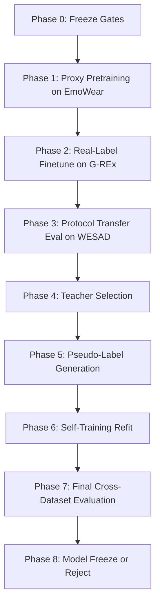

# Multi-Dataset Self-Training Plan

## Goal

Build a controlled `arousal/activity` training loop that uses multiple external datasets without mixing label qualities blindly.

The plan starts only after the following are true:

1. `audit-wesad` passes;
2. `G3.1 LOSO` is frozen as the current safe baseline;
3. `g3-2-multi-dataset-strategy` is generated;
4. `g3-2-multi-dataset-protocol` reports `overall_status=ready`.

Current readiness on `2026-03-27`:

1. `overall_status = ready`
2. `wesad harmonized_feature_count = 80`
3. `grex harmonized_feature_count = 16`
4. `emowear harmonized_feature_count = 28`
5. `dapper = skipped`

## Dataset Roles

| Dataset | Label tier | Role | Allowed usage |
| --- | --- | --- | --- |
| `grex-v1` | `real` | `primary_supervision` | Headline supervised finetuning and final model selection anchor |
| `emowear-v1` | `proxy` | `auxiliary_pretraining` | Representation warm-start, robustness regularization |
| `wesad-v1` | `protocol-mapped` | `protocol_transfer_or_eval` | Transfer check, protocol-state stress test, out-of-domain evaluation |
| `dapper-v1` | `proxy` | `skip` | Excluded until coverage is fixed |

## Hard Rules

1. Final model selection is driven by `real-label` metrics only.
2. `WESAD` and other protocol/proxy datasets cannot override a worse result on `G-REx`.
3. Synthetic or AI-generated data is allowed only as bounded augmentation.
4. Pseudo-labels must be separated from ground-truth labels in all reports and artifacts.
5. Every self-training phase must be reversible and auditable.

## Training Flow

## Phase 0 - Freeze Gates

Objective:

Freeze the safe starting point before any self-training loop begins.

Inputs:

1. `/Users/kgz/Desktop/p/on-go/data/external/wesad/artifacts/wesad/wesad-v1/model-zoo-benchmark-loso/`
2. `/Users/kgz/Desktop/p/on-go/data/external/multi-dataset/strategy/`
3. `/Users/kgz/Desktop/p/on-go/data/external/multi-dataset/protocol-execution/`

Checks:

1. `selected-features.csv` contains no forbidden shortcuts;
2. split audit is clean;
3. readiness gate has no blocking phases;
4. base candidate list is frozen.

Exit criteria:

1. baseline candidates registered;
2. teacher-candidate families approved for training.

## Phase 1 - Proxy Pretraining (`EmoWear`)

Objective:

Initialize representations on broader proxy physiology without using proxy metrics as headline evidence.

Allowed models:

1. `xgboost`
2. `lightgbm`
3. `catboost`
4. simple linear baselines for control

Outputs:

1. pretrained checkpoints;
2. feature-importance summaries;
3. per-class support report;
4. calibration snapshot.

Metrics to monitor:

1. proxy macro-F1
2. balanced accuracy
3. log loss or cross-entropy
4. confidence histogram
5. calibration error

Guardrails:

1. no promotion based on proxy score alone;
2. no model accepted if confidence is over-concentrated;
3. keep a no-pretraining control branch.

## Phase 2 - Real-Label Finetune (`G-REx`)

Objective:

Move from proxy-pretrained weights or proxy-informed hyperparameters to the only headline supervised source.

Protocol:

1. subject-grouped evaluation only;
2. same feature family across compared models;
3. compare against no-pretraining control;
4. preserve fixed seed grid.

Primary metrics:

1. `macro_f1`
2. `balanced_accuracy`
3. `mae` for ordinal arousal where available
4. `quadratic_weighted_kappa`
5. worst-subject degradation

Selection rule:

1. a candidate survives only if it improves or matches the control on `G-REx` mean metric and does not violate worst-subject guardrails.

## Phase 3 - Protocol Transfer Evaluation (`WESAD`)

Objective:

Check whether the `G-REx`-selected candidates transfer to `WESAD` protocol states without relying on `WESAD` as the primary supervision source.

What to inspect:

1. `stress vs amusement` confusion;
2. fold variance under LOSO;
3. failure cases by subject;
4. calibration drift relative to `G-REx`.

Interpretation:

1. strong transfer is a positive sign;
2. weak transfer is diagnostic, not an automatic rejection, unless it indicates feature collapse or numeric instability.

## Phase 4 - Teacher Selection

Objective:

Choose a teacher model for pseudo-labeling.

Teacher eligibility:

1. top tier on `G-REx` real-label metrics;
2. acceptable calibration error;
3. stable under seeds/folds;
4. no abnormal confidence spikes;
5. no evidence of shortcut reliance.

Recommended teacher set:

1. best gradient boosting candidate;
2. best simpler control candidate;
3. optional ensemble only if it beats both on calibration and variance.

## Phase 5 - Pseudo-Label Generation

Objective:

Generate pseudo-labels only for examples where the teacher is confident and consistent.

Candidate pools:

1. low-confidence or filtered-out segments from existing datasets;
2. unlabeled windows from compatible raw data;
3. never synthetic-only corpora.

Acceptance rules for a pseudo-label:

1. confidence above threshold;
2. entropy below threshold;
3. optional agreement across two teachers;
4. class-balance cap per iteration;
5. source dataset and iteration id recorded.

Stored artifacts:

1. `pseudo-labels.csv`
2. `pseudo-label-quality-report.json`
3. confidence plots
4. class-balance plots

## Phase 6 - Self-Training Refit

Objective:

Refit the student with a controlled mix of real labels and pseudo-labels.

Mixing policy:

1. real labels weight = `1.0`
2. pseudo-labels weight < `1.0`
3. cap pseudo-labeled sample ratio per class;
4. keep previous best supervised model as an immutable baseline.

Recommended schedule:

1. Iteration 1: conservative ratio, highest threshold;
2. Iteration 2: expand only if Phase 7 improves;
3. stop after first non-improving iteration.

Required comparisons:

1. supervised-only baseline;
2. proxy-pretrained + finetuned baseline;
3. self-trained student;
4. ablation with and without pseudo-label weighting.

## Phase 7 - Final Cross-Dataset Evaluation

Objective:

Evaluate the student against all approved datasets and all relevant baselines.

Evaluation table must contain:

1. per-dataset metrics;
2. per-class metrics;
3. per-subject distributions;
4. confidence intervals;
5. confusion matrices;
6. calibration metrics;
7. worst-case degradation.

Mandatory plots:

1. leaderboard with CI;
2. per-phase metric trajectory;
3. calibration curve by phase;
4. confusion matrix for winner;
5. subject-level boxplots;
6. pseudo-label acceptance curve;
7. model comparison heatmap (`dataset x model`);
8. degradation chart relative to supervised baseline.

## Phase 8 - Freeze Or Reject

Promote a self-trained model only if all are true:

1. `G-REx` headline metric improves versus supervised baseline;
2. no safety gate regresses;
3. worst-subject degradation stays within guardrail;
4. calibration does not materially worsen;
5. `WESAD` transfer does not show collapse;
6. improvement is reproducible across seeds.

Reject the self-training branch if any of these occur:

1. gain exists only on proxy/protocol datasets;
2. `G-REx` real-label metric is flat or worse;
3. confidence inflation grows while accuracy does not;
4. minority-class recall drops below baseline guardrail.

## Verification Order

Use this review order after every phase:

1. check data provenance table;
2. inspect feature list and safety audit;
3. inspect phase metrics against previous phase;
4. inspect class support and confusion matrices;
5. inspect calibration and confidence histograms;
6. inspect subject-level worst cases;
7. decide `promote / rerun / reject`.

## Artifact Contract

Every phase should emit a dedicated folder with at least:

1. `evaluation-report.json`
2. `model-comparison.csv`
3. `per-subject-metrics.csv`
4. `research-report.md`
5. `plots/`

Additional self-training artifacts:

1. `teacher-selection.csv`
2. `pseudo-labels.csv`
3. `pseudo-label-quality-report.json`
4. `phase-transition-report.md`

## Practical Execution Order

Run phases in this exact order:

1. `proxy_pretraining` on `EmoWear`
2. `real_label_finetune` on `G-REx`
3. `protocol_transfer` on `WESAD`
4. `teacher_selection`
5. `pseudo_label_generation`
6. `self_training_refit`
7. `cross_dataset_evaluation`
8. `model_freeze_decision`

## Notes

1. `XGBoost` and `CatBoost` should both stay in the candidate pool until `G-REx` and self-training comparisons are complete.
2. `CatBoost` being better on `WESAD activity` does not imply it is the best `arousal` teacher.
3. `WESAD` remains useful as a transfer stress test, but not as the final authority for `arousal` selection.
